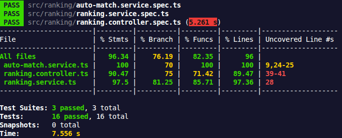

## Pour lancer l'application

Ouvrir 2 terminaux et faire à la racine:

`(npx) pnpm --filter realtime-elo-ranker-server run start:dev`

`(npx) pnpm --filter realtime-elo-ranker-client run dev`

## Pour lancer les tests et voir le coverage

Ouvrir un terminal et faire à la racine:

`(npx) pnpm --filter realtime-elo-ranker-server test --coverage`

